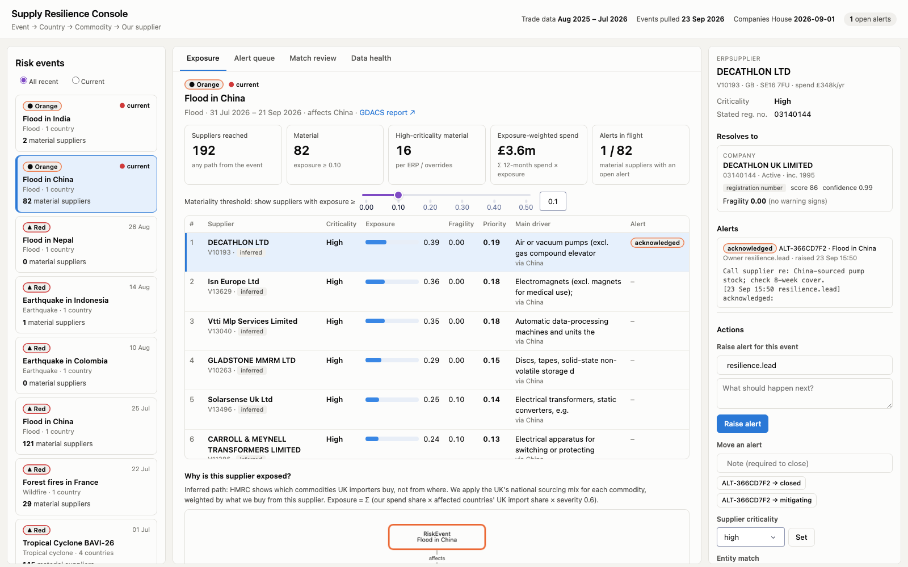

# Supply Resilience Console

**An ontology-driven operational app that answers one question: "Something just happened in the world. Which of *my* suppliers are exposed, why, and what are we doing about it?"**

It fuses a (synthetic) client ERP extract with four messy public sources (Companies House, HMRC trade statistics, GDACS disaster alerts and the UK Sanctions List) into an explicit ontology of objects, links and actions. On top of that sits an event-first dashboard where decisions write back into the model.



---

## The pattern

Most analytics projects go **data → dashboard**. This one goes **decision → ontology → data → application → writeback**:

| Layer | What it is here | Foundry equivalent |
|---|---|---|
| Decision | "Which suppliers does this event hit, and what's being done?" | The use case |
| Ontology | 8 object types, 9 link types, 5 action types in [`ontology/ontology.yaml`](ontology/ontology.yaml) | Ontology Manager |
| Pipelines | raw → clean → resolution → ontology tables in DuckDB | Pipeline Builder / transforms |
| Contract | 49 automated checks: PK uniqueness, referential integrity, cardinality | Health checks / data expectations |
| Graph | Generic NetworkX builder that reads the YAML (89k nodes, 223k edges) | Object Set / Search Around |
| App | Dash console: events → ranked exposure → path explanation | Workshop |
| Actions | Validated, logged edits stored separately from source data | Action types + writeback datasets |

### The ontology

```
RiskEvent ─affects─▶ Country ◀─flow_from_country─ ImportFlow ─flow_of_commodity─▶ Commodity
                        ▲                                                             ▲
                        └──────── located_in ──── ERPSupplier ◀─ordered_from─ PurchaseOrderLine
                                                    │    ▲
                                    resolves_to     ▼    └── alert_about ── Alert (writeback)
                                                  Company ─imports─▶ Commodity
```

Two modelling decisions carry most of the weight:

- **`ImportFlow` is an object, not a link.** The relationship between a commodity and a country carries data of its own (value, share, period). Once a relationship has properties, it becomes an object.
- **`resolves_to` is a link with evidence, not a merge.** ERP vendors and HMRC traders have no reliable company ID. Each resolved link stores its method, score and confidence, and a human can confirm or reject it. Human decisions override the machine on every rebuild.

## What's in the data

| Source | Scale | Real defects handled |
|---|---|---|
| Companies House bulk data | 5.69M companies | A row with 5 SIC codes under a 4-column header shifts later fields, so SIC codes are parsed by pattern |
| HMRC importer list | 40,299 in-scope traders | No company number; >50 codes spill onto continuation rows |
| HMRC Overseas Trade Statistics API | 51,538 commodity × country flows | Split by port; non-ISO codes (`XS` = Serbia; Dubai and Abu Dhabi listed as separate countries); £793m of trade with no mappable country |
| GDACS | 45 Orange/Red events | Events span many countries (many-to-many) |
| UK Sanctions List | 58k rows | Metadata line above the header; one row per alias |
| Synthetic ERP (Oracle `AP_SUPPLIERS` style) | 201 vendors, 2,554 PO lines | Typos, LTD/LIMITED drift, reg numbers missing leading zeros, duplicate vendors, EUR/USD, `DD-MON-YY` dates |

## Results

- **Entity resolution:** 98.9% precision and 97.9% recall on ERP vendors, measured against a ground-truth file the pipeline never reads. v1 scored 95.1% / 92.1%. It matched subsidiaries to their parent companies at the same address because the normaliser stripped "GROUP" and "HOLDINGS". See [docs/02](docs/02_pipeline_and_graph.md).
- **Two implementations, one answer:** exposure is computed both by graph traversal and in SQL, and a test asserts they agree to 1e-9 across events.
- **Materiality over reachability:** a flood in China *reaches* 192 of 201 suppliers but is *material* for 82. An earthquake in Indonesia reaches 128 but matters for 1, a direct steel supplier. The console ranks by priority rather than listing everything the event touches:

  `priority = exposure × criticality weight × (1 + fragility) / 2`

## Run it

```bash
python -m venv .venv && .venv/bin/pip install -r requirements.txt
.venv/bin/python pipeline.py        # ~2 min cold (downloads ~800 MB), ~20 s warm
.venv/bin/python -m pytest -q tests
.venv/bin/python app/app.py         # http://127.0.0.1:8050
```

## Repository map

```
ontology/ontology.yaml        the semantic layer: objects, links, actions (single source of truth)
src/scm/ingest/               one module per source; each documents the defects it handles
src/scm/transform/resolve.py  entity resolution: blocking → scoring → decision, evidence kept
src/scm/transform/build.py    clean → ontology tables; apply_edits() re-applies writeback
src/scm/transform/scoring.py  fragility, country risk, exposure, priority (all explainable)
src/scm/ontology.py           YAML loader + contract validation
src/scm/graph.py              generic graph builder, traversal, exposure breakdown
src/scm/actions.py            the verbs: validate → write to writeback → log → refresh
app/                          Dash console (service layer + UI)
docs/                         design notes per milestone + interview notes
```

## Known limitations

- **Country granularity:** a provincial flood "affects China". Next step: intersect GDACS polygons with port and province locations.
- **Inferred sourcing:** HMRC doesn't publish each trader's source countries, so UK vendors inherit the national import mix. This is labelled as `inferred` everywhere it's used.
- **Weights are judgement calls:** the fragility and priority weights are hand-set and documented, not learned. With real incident history they should be calibrated.
- **Single-user:** DuckDB allows one writer at a time, so the pipeline and the app can't run simultaneously. In Foundry this concurrency is handled by the platform.
